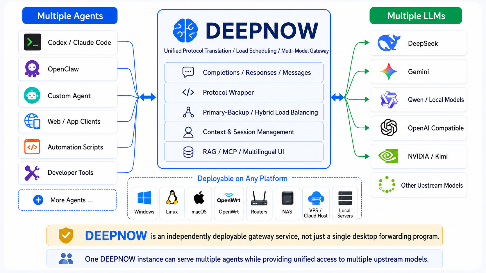

# ⚡ DeepNow : The Ultimate AI Compute Gateway ( Router )

<div align="center">


**All-in-One Aggregated AI Gateway & Intelligent RAG Fusion Engine**

[](https://golang.org/)
[](LICENSE)
[](#)
[](#)
[](https://ziglang.org/)

*Building an ultra-stable, seamlessly integrated, privatized AI compute orchestrator.*

</div>

<div align="right">
  <a href="README-eng.md">English</a> | <a href="README.md">简体中文</a>
</div>

## ⚡ What is DeepNow

&nbsp;&nbsp;&nbsp;&nbsp;&nbsp;&nbsp;&nbsp;&nbsp; In the current era where **Token** is king, **DeepNow** is an enterprise-grade AI model gateway (router) and local knowledge fusion engine engineered for high availability and high concurrency. It not only unifies the management, scheduling, and orchestration of isolated Large Language Models (LLM/VLM) and Embedding models but also aggregates them through binding algorithms to achieve seamless compute consolidation and disaster recovery. By consolidating resources from multiple upstream providers, it maximizes token throughput for your frontend applications or automated development environments. Through adaptive pooling, you can easily break through upstream API limits (TPM, RPM, concurrency ceilings). Whether handling multi-user team vibe coding, long-context fusion pipelines, or high-density burst traffic requests, DeepNow serves as your industrial-grade token-level "Soft Router". It intercepts and manages token streams rather than TCP/IP packets, operating as a true Token Router / Token Gateway (TR/TG).

&nbsp;&nbsp;&nbsp;&nbsp;&nbsp;&nbsp;&nbsp;&nbsp; With DeepNow, you can point the token endpoints of all frontend apps or developer tools to DeepNow to achieve unified traffic shaping, cascading load balancing, and hot reloads for specific configurations. You no longer need to configure separate API keys for individual upstream token providers; all downstream applications simply point to a single API Key and Endpoint URL exposed by DeepNow. Typically, switching models in an AI application requires manually editing the Endpoint URL and API Key for each tool, which is tedious and error-prone. For production-grade user-facing apps, such switchovers can be prohibitively expensive—especially for stateful Agent systems where altering endpoints can break the agent or corrupt its tool-calling capabilities. DeepNow brings live hot-swappable model routing to all your tools, enabling key-based semantic routing similar to OpenRouter but completely local. A locally deployed AI gateway guarantees peace of mind, eliminating network jitter, external API downtime, or data privacy risks.

&nbsp;&nbsp;&nbsp;&nbsp;&nbsp;&nbsp;&nbsp;&nbsp; However, DeepNow's capabilities go far beyond simple proxying.

&nbsp;&nbsp;&nbsp;&nbsp;&nbsp;&nbsp;&nbsp;&nbsp; If you are a team or enterprise administrator, you certainly do not want to distribute master provider keys to every employee, as leaked keys can cause catastrophic financial losses. Concurrently, you need real-time telemetry on token consumption per user/application, or a robust mechanism to distribute compute costs among a multi-tenant workspace. DeepNow solves this natively. It can generate and provision its own downstream API keys, mapping each key to specific concurrency pools, restricted model sets, and token rate limits, with instant revocation controls.

&nbsp;&nbsp;&nbsp;&nbsp;&nbsp;&nbsp;&nbsp;&nbsp; If you intend to deploy an enterprise-grade knowledge agent, you don't need any complex external toolchains. Whether importing internal knowledge wikis or feeding specialized operational playbooks, you can hydrate data into DeepNow with a zero-friction, click-and-run workflow. Without requiring any deep model fine-tuning experience, you gain a zero-dependency solution that leverages world-class LLM brains to read, interpret, and internalize your private domain data, creating a custom digital employee. When multiple clients hit your endpoint, they all inherit this private knowledge stack along with its strict logical reasoning and deterministic response profiles. DeepNow is purpose-built to eliminate hallucinations in mission-critical environments like onboarding, medical consultation, research pipelines, or product demos.

&nbsp;&nbsp;&nbsp;&nbsp;&nbsp;&nbsp;&nbsp;&nbsp; Currently, the landscape of AI agents and heterogeneous models has led to fragmented protocols across frontends and backends. As the industry evolves, the classic, universally compatible `v1/completions` protocol is being deprecated in favor of more advanced `Responses` and `Messages` protocols. However, these modern interfaces often embed proprietary specifications and upstream lock-ins, breaking cross-compatibility. DeepNow eliminates this protocol friction. Without purchasing expensive enterprise cloud services, you can locally orchestrate OpenClaw, Codex Desktop, or Hermes agents across any target LLM. Crucially, DeepNow unlocks an advanced lock-free concurrency racing mode for these agents, exponentially slicing down task completion times—a performance milestone unmatched by any other AI gateway.

&nbsp;&nbsp;&nbsp;&nbsp;&nbsp;&nbsp;&nbsp;&nbsp; Looking ahead, DeepNow will continuously integrate enterprise features including managed MCP servers, local plugin architectures, server-side background task loops, model-agnostic session context tracking, server-side skills, and multimodal pipeline aggregation. (For instance, chaining a specialized vision encoder with a distinct high-speed text reasoner and a separate image generation model to synthesize a unified response layout; after all, no single model reigns supreme in every vector, and we must route token compute based on exact technical demands).

&nbsp;&nbsp;&nbsp;&nbsp;&nbsp;&nbsp;&nbsp;&nbsp; In short, DeepNow represents a critical piece of AI infrastructure: a highly optimized, stateful compute foundation and an elastic token flow router ready to mount advanced next-gen capabilities.

## ⚡ Basic Architecture

  <div align="center">
    
    <p><i>Basic Architecture</i></p>
  </div>

## ⚡ What Pain Points Does DeepNow Address?

<details>
  <summary><b>🎯 Arbitrary Model Delivery</b></summary>
  <br>
&nbsp;&nbsp;&nbsp;&nbsp;&nbsp;&nbsp;&nbsp;&nbsp;Probably the only AI Routing solution that enables cross-model context delivery.<br><br>
&nbsp;&nbsp;&nbsp;&nbsp;&nbsp;&nbsp;&nbsp;&nbsp;That is to say, after you have completed part of your work, as long as your agent or chat client maintains the context, you can have the first part of the same session completed by one model, and when an unexpected situation requires switching to another model to continue, you do not need to start a new conversation at all. deepnow will reload your context and redeliver it in a format acceptable to the target model, allowing you to resume your unfinished work. For example: Deepseek writes a piece of code but runs out of tokens, and you happen to have Gemini on hand – you can immediately mount Gemini to continue your work. Under normal circumstances, the two models have many differences in their payloads; without deepnow, simply changing the endpoint in your agent or client would not allow you to continue.
</details>
<details>
  <summary><b>🚀 Protocol Wrapper & Transpilation</b></summary>
  <br>
&nbsp;&nbsp;&nbsp;&nbsp;&nbsp;&nbsp;&nbsp;&nbsp;The model landscape is mutating rapidly, with fragmented protocol formats: some are native single-model multimodal, others expose unified multi-model endpoints, while some still lean on legacy completions or strict SSE streams. If a frontend tool attempts to switch to an arbitrary upstream model, payload structural mismatches frequently yield HTTP 400 Bad Request errors. What if an advanced IDE plugin expects the latest stateful Responses protocol, but your target model only interprets legacy Completions parameters? Conventional AI gateways simply act as transparent pass-through proxies, failing to provide downstream schema consistency. This forces you to either abandon your favorite frontend client or change your model.<br><br>
&nbsp;&nbsp;&nbsp;&nbsp;&nbsp;&nbsp;&nbsp;&nbsp;DeepNow's protocol wrapper smoothly irons out these frontend-backend discrepancies. We support dual-mode routing: 1) Protocol Hijacking & Transpilation, and 2) Native Pass-through. Impressively, whether utilizing transpilation or raw proxying, the system fully maintains its cascading load-balancing matrix and local RAG fusion pipelines. Frontend apps remain decoupled from upstream variations, requiring compatibility with only a single generic endpoint standard (Completions/Responses/Messages).
</details>
<details>
  <summary><b>🧠 Token-Aware Optimal Routing ("Optimal Choice")</b></summary>
  <br>
&nbsp;&nbsp;&nbsp;&nbsp;&nbsp;&nbsp;&nbsp;&nbsp;Beyond model pooling, multi-channel hybrid routing, and failover mechanics, DeepNow embeds a proprietary "Optimal Choice" scheduling algorithm, delivering optimal solutions for two critical runtime patterns:<br><br>
  1) Concurrency Racing (Latency-First): The gateway broadcasts an incoming inference request simultaneously to $\ge 2$ configured fast, lightweight channels (including local models). The first channel to return an indexable First Token (TTFT) instantly locks onto the client stream, while the redundant worker threads are gracefully aborted, squeezing down latency under heavy load.<br><br>
  2) Layered Cascade Routing (Re-rank): Queries are automatically evaluated against model reasoning tiers. A lightweight model first intercepts the payload to classify intent and extract semantic features, subsequently escalating the query to an optimally rated reasoning node. This ensures granular token-billing optimization and highly accurate inference outcomes.
</details>
<details>
  <summary><b>🚀 High Availability & Compute Pooling: Breaking Concurrency Ceilings</b></summary>
  <br>
&nbsp;&nbsp;&nbsp;&nbsp;&nbsp;&nbsp;&nbsp;&nbsp;You might be struggling with fragmented token pools that fail to deliver high-concurrency, low-latency responsiveness. Standard non-enterprise API keys come bound to strict rate limiting frameworks (`RPM` for requests per minute, `TPM` for tokens per minute, `RPD` for daily limits). No matter how much you optimize application-side code, upstream rate limits cannot be bypassed. <b>DeepNow shatters this bottleneck.</b> Through our innovative compute pooling architecture, you can bundle multiple cost-effective developer or individual keys into a unified virtual cluster whose combined throughput mirrors or surpasses premium enterprise tiers. Furthermore, you can aggregate open-source models running across separate physical hardware networks into a single, highly available endpoint array. In mission-critical environments, frontend apps will never display embarrassing errors like "...high demand, please try again later...". DeepNow captures upstream anomalies in real-time, executing an atomic failover retry to a backup model in milliseconds, keeping the entire recovery lifecycle completely transparent to the client.
</details>
<details>
  <summary><b>🛡️ Secure Multi-Tenant Compute Sharing</b></summary>
  <br>
&nbsp;&nbsp;&nbsp;&nbsp;&nbsp;&nbsp;&nbsp;&nbsp;Whether serving hardcore AI geeks running intense Hermes/OpenClaw setups or orchestrating multi-user corporate spaces, DeepNow facilitates safe resource sharing across multiple clients. DeepNow ships with a robust self-managed API Key provisioning framework. A single master key can be bound across all your tools, or individual sub-keys can be distributed to separate users. Historically, multi-regional concurrent calls utilizing identical upstream keys frequently triggered account bans or leaked credential hashes. By routing traffic through DeepNow, true upstream keys are securely abstracted behind the gateway layer; to the provider, all incoming streams originate from DeepNow, neutralizing telemetry risks. DeepNow records complete token ingestion and emission logs inside in-memory caches and persists them to local/external database layers (SQLite/MySQL), enabling downstream tracking or custom secondary billing UIs.
</details>
<details>
  <summary><b>📦 Agile Deployment & High Performance (Zero Dependencies, Out-of-the-Box)</b></summary>
  <br>
&nbsp;&nbsp;&nbsp;&nbsp;&nbsp;&nbsp;&nbsp;&nbsp;The majority of open-source AI utilities depend heavily on Python, which introduces convoluted dependency dependency chains, version mismatches, and structural runtime performance bottlenecks. DeepNow is engineered from day one to match enterprise-grade high-throughput demands, written in compiled Go fused with highly optimized C components. The system features a fully self-contained architecture—even the static UI administration dashboard is compiled directly into the single binary asset. No messy component tracking, no external database dependencies, and no heavy Docker footprints. Download and execute; that’s it. Simply grab the target architecture binary and achieve instant deployment. All runtime parameters are fully manageable via an intuitive HTML5 control center, eliminating manual configuration editing. Get the service up in milliseconds, then fine-tune parameters—this is the peak agile experience designed by DeepNow.
</details>
<details>
  <summary><b>🧠 Transparent RAG Injection (Hot-Swappable Semantic Brain)</b></summary>
  <br>
&nbsp;&nbsp;&nbsp;&nbsp;&nbsp;&nbsp;&nbsp;&nbsp;Both individual power users and large organizations face the challenge of converting private knowledge vectors into robust AI memory. <b>DeepNow seamlessly orchestrates any arbitrary LLM to compute over this knowledge</b>. Frontend applications are completely liberated from compiling complex RAG chunking and retrieval flows; DeepNow handles vector space lookups at the gateway layer, dynamically weaving relevant context directly into the prompt payload before it hits the model. The gateway supports strict fallback constraints: if a query fails to trip semantic thresholds, it can be short-circuited or downgraded to the LLM's baseline weights. More cleverly, our multi-channel routing pipeline applies to the retrieval phase as well; no single upstream provider ever receives your full raw context stack, physically neutralizing data chain leakage risks. In hyper-specialized domains requiring zero hallucination (Temperature = 0), DeepNow applies target prompt injection techniques to align structural consistency across divergent models. The semantic framework supports cross-modal retrieval (text, diagrams, audio charts), allowing cross-model processing to combine outputs while returning a single, unified inference response. Regardless of whether textual records or structured knowledge graphs are supplied, DeepNow seamlessly indexes and orchestrates them for accurate downstream reasoning task enforcement.<br><br>
&nbsp;&nbsp;&nbsp;&nbsp;&nbsp;&nbsp;&nbsp;&nbsp;The foundational core of **DeepNow** is the absolute decoupling of private data logic from raw inference engines. The LLM scales down to a raw, stateless compute unit—an intellectual commodity—while the underlying knowledge base serves as the actual brain of your AI system. DeepNow provides an integrated scheduling ring where you can hot-swap, plug in, or disconnect cloud models, local nodes, or knowledge segments on the fly, tailoring your deployment state instantly. Technologically, this is achieved through multi-dimensional semantic search, cosine distance filtering, atomic re-indexing, Re-rank algorithms, and semantic query expansion. It mirrors the exact behavioral profile of a custom pre-trained private model without the prohibitive overhead of compute training.<br><br>
&nbsp;&nbsp;&nbsp;&nbsp;&nbsp;&nbsp;&nbsp;&nbsp;Furthermore, DeepNow possesses continuous self-directed learning capabilities, transforming authorized transaction logs into persistent vector memories with zero context window boundaries.
</details>
<details>
  <summary><b>🌐 Hierarchical Distributed Compute Network (Infinite Cascading)</b></summary>
  <br>
&nbsp;&nbsp;&nbsp;&nbsp;&nbsp;&nbsp;&nbsp;&nbsp;**DeepNow** nodes can be recursively cascaded! Beyond raw compute sharing, session memory states and private localized RAG indices can be seamlessly invoked by sibling or parent DeepNow instances, as the semantic context is fully serialized within the streaming server-sent events (SSE). You can deploy multiple specialized DeepNow instances across separate operational zones (e.g., Node A managing corporate HR knowledge graphs, Node B tracking product engineering specifications, Node C processing executive operational data) and aggregate them under a master root node. This lets you synthesize a multi-domain super-intelligent private AI hub, where frontend clients connect to restricted sub-nodes or the overarching root gateway based on explicit authorization profiles.
</details>

##  ⚡ Competitive Landscape & Matrix Comparison


| Dimension / Feature | **DeepNow (Edge-Local Gateway)** | **Cherry Studio (CC Switch)** | **OpenRouter (Cloud SaaS)** | **OneAPI / NewAPI (Proxy System)** |
| :--- | :--- | :--- | :--- | :--- |
| **Local Gateway Capability** | ✅**Core or Edge Gateway**<br>· Ultra-agile deployment, lightweight runtime<br>· Embedded high-concurrency middleware, runs as a local background daemon | ❌**Desktop Client Only**<br>· View-level interface switching<br>· Restricted to single-user local application context | ❌**Cloud Commercial SaaS**<br>· Centralized remote hosting<br>· Mandatory external internet connection | ❌**Cloud-Native Middleware**<br>· Dependent on heavy Docker containers<br>· Strict runtime reliance on multiple external components, complex deployment |
| **High-Concurrency Scheduling & Cache** | ✅**Microsecond Memory State Machine**<br>· Atomic in-memory cache and dictionary tries for $O(1)$ lookup performance<br>· Concurrency lock mechanisms prevent I/O starvation under burst traffic peaks | ❌**No Concurrency Handling**<br>· Limited to static client-side proxying and single-point routing switching | ✅**Cloud Elastic Scaling**<br>· High-throughput remote handling capacity<br>· Enterprise metering and tenant traffic controls | ❌**Database-Driven Polling**<br>· High-frequency relational DB reads per request to deduct quota and check channels<br>· DB connection limits act as severe performance bottlenecks under high QPS |
| **Credential Security** | ✅**Device-Fingerprint AES Encryption**<br>· Derived cryptographic MasterID locked to local physical hardware<br>· Local config files heavily obfuscated to prevent credential theft; admin-exportable | ❌**Plaintext Storage**<br>· API credentials stored raw inside local client storage directories without device-level protection | ❌**Remote Managed Vault**<br>· API keys are fully entrusted to and held on OpenRouter's cloud databases | ❌**Standard Relational Encryption**<br>· Relies on baseline MySQL/PgSQL database protections and typical hashing metrics |
| **Vector Engine** | ✅**Embedded Native Semantic Base**<br>· Low-overhead C-level `sqlite-vec` engine compiled into core binary<br>· Supports concurrent high-frequency text chunking and immediate vectorization | ❌**External Hook / Missing Core**<br>· Depends on external app integrations or third-party cloud-hosted vector endpoints | ❌**No Semantic Layer**<br>· Strictly restricted to raw LLM protocol handling and token stream distribution | ❌**No In-Memory Vector Pool**<br>· Acts strictly as a forwarding pipe; some forks patch this via clunky third-party plugins |
| **Knowledge Retrieval** | ✅**RRF Dual-Track Reciprocal Rank Fusion + Hard Kill**<br>· Normalized hybrid evaluation blending **Vector + Tag + Semantic Re-rank**<br>· Anti-representation drift safeguards built-in<br>· **2-Stage Slider Short-Circuiting**: Queries below threshold completely cut off external model routing and return custom markers, stopping hallucinations at zero cost | ❌**No Retrieval Engine**<br>· RAG processes must be handled manually by client-side application prompt assemblers | ❌**No Filtering Layer**<br>· Incapable of parsing tenant business data; all blind-spot queries are pushed upstream, racking up billable tokens | ❌**No Semantic Guardrails**<br>· Purely transparent network pipeline; unable to intercept or short-circuit queries based on knowledge hit-rates |
| **Protocol Compatibility** | ✅**Full Responses/Completions Wrapper**<br>· Advanced parsing of stateful Responses and client Runs topology state machines<br>· Auto-reconstructs multi-turn Agent trace histories and multimodal payloads; bidirectional transpilation | ❌**Standard Single-Turn Protocol**<br>· Primitive structural conversion profiles | ✅**Generic Cloud Translation**<br>· Focuses on cloud vendor Chat protocol flattening; lacks deep stateful Responses tracking | ❌**Legacy Protocol Focused**<br>· Designed for basic `v1/chat/completions` flattening; completely lacks stateful agent thread orchestration |
| **Edge Microservices & Expansion** | ✅**Built-In Secured MCP Server**<br>· Evaluates and executes model tools locally<br>· Directly exposes and tracks local compute microservices to clients like Codex Desktop | ❌**MCP Client Only**<br>· Imports external MCP endpoints; incapable of operating as a secured local microservice provider | ❌**Cloud Endpoint Only**<br>· Geographically isolated from interacting with or managing resources in a local network cluster | ❌**No Edge MCP Protocol Layer**<br>· Lacks mechanisms to intercept, evaluate, and restructure local hardware toolchains |
| **High Availability & Load Balancing** | ✅**Primary/Slave Dual Track + Auto-Self-Healing + Compute Pooling + Hyper-Hybrid Configuration**<br>· Instant gateway-layer orchestration with native TLS certificate attachment capabilities | ❌**Basic Failover Only**<br>· Elementary error-switching optimized solely for local desktop clients | ✅**Cloud Failover, Rigid Balancing**<br>· Remote multi-channel fallback switching; however, long network paths can impact TTFT stability | ✅**Weighted Relational Load Balancing**<br>· Weighted round-robin routing driven by database status tables; lacks end-of-life transactional reconstruction |
| **Self-Provisioned Key System** | ✅**Comprehensive Downstream Key Management**<br>· Limitless key provisioning with fine-grained tracking metrics for models, time windows, and token ceilings | ❌**Single-User Desktop Profile**<br>· Missing tenant provisioning system | ❌**Commercial Consumer SaaS**<br>· Sells aggregated upstream compute; cannot be deployed to build your own private key provisioning infrastructure | ✅**Commercial Quota Key Generation**<br>· Rich multi-tier key structure with quota configurations |
| **Efficiency & Usability** | ✅**Zero Dependency Runtime**<br>· No npm, no node.js required; packages high-speed WebUI out-of-the-box for edge deployment<br>· Native Go runtime thread concurrency | ❌**Heavily Dependent Runtime**<br>· Electron-based node.js desktop interface talking to headless processes via IPC; bounded to client machines | ❌**Zero Deployment Overhead**<br>· Instant API consumption but subject to external premium billing structures | ❌**Multi-Layer Component Matrix**<br>· Resource-intensive deployment; high-concurrency capability hampered by frequent database read validation loops |
| **Protocol Wrapper** | ✅**Bi-Directional Wrapper Architecture**<br>· Dynamically transforms Completions queries to Responses and vice versa, rendering all models universal | ❌**Transparent Proxying**<br>· Standard protocol pass-through mapping | ❌**Transparent Proxying**<br>· Flat standard cloud payload mapping | ❌**Transparent Proxying**<br>· Linear string/field rewriting |


## ⚡ Pictures
<details>
  <summary>Click to Expand</summary>
  <div align="center">
    
    <p><i>Network Topologies</i></p>
  </div>
  <div align="center">
    
    <p><i>Compute Configuration</i></p>
  </div>
  <div align="center">
    
    <p><i>Session Memory Policies</i></p>
  </div>
  <div align="center">
    
    <p><i>Downstream API Token Overview</i></p>
  </div>
  <div align="center">
    
    <p><i>Compute Core Allocation</i></p>
  </div>
</details>

## ⚡ Capability Building

  <div align="center">
    
    <p><i>Capability Building</i></p>
  </div>

---

## ⚡ Quick Start (Out-of-the-Box)

DeepNow leverages full static compilation and asset inlining technologies to provide an out-of-the-box runtime environment with zero deployment friction. Outside of configuring your base model and embedding API addresses, no external databases or runtime dependencies are required. The production release asset drops all dependencies on Docker or Node.js/npm environments—a clean, self-healing, cross-platform single binary managing your complete suite (built-in GUI control console, embedded vector database, relational system tracker).

```bash
# 1. Spin up the DeepNow daemon
With Linux:
./deepnow       (console)
or
nohup ./deepnow >& /dev/null &       (background daemon)

Windows 下:
double click deepnow.exe (It is not recommended to run this on your local machine.)

# When the initialization logs and listening address appear in the terminal, the service is fully operational. DeepNow binds natively across all available interface IPs.

# Once initialized, the administrative configuration UI becomes accessible.

# The GUI Dashboard binds defaults to port 8084 via HTTP (restricted strictly to 127.0.0.1 for baseline security).

Simply navigate your browser to [http://targetip:8084] ,or running under local just visit http://127.0.0.1:8084/ to start. Ports are fully customizable via the control center.

# Note: By default, the gateway exposes AI endpoint routes over HTTP.
# You can easily toggle TLS (HTTPS) mode inside the 8084 GUI dashboard. Upon the first toggle, the system automatically cuts a 10-year self-signed certificate asset. However, strict downstream enterprise clients (e.g., Codex Desktop) might require validated certificate authorities.
# For standalone sandbox development or local engineering clusters, keeping the endpoint in HTTP mode guarantees maximum cross-compatibility across all client tools.

Running it for the first time will generate a vector database and multiple configuration files in the DeepNow installation directory.


<div align="left">
  <a href="/doc/codex.md">Codex Config HOWTO</a> | <a href="/doc/hermes.md">Hermes Config HOWTO</a>
</div>

