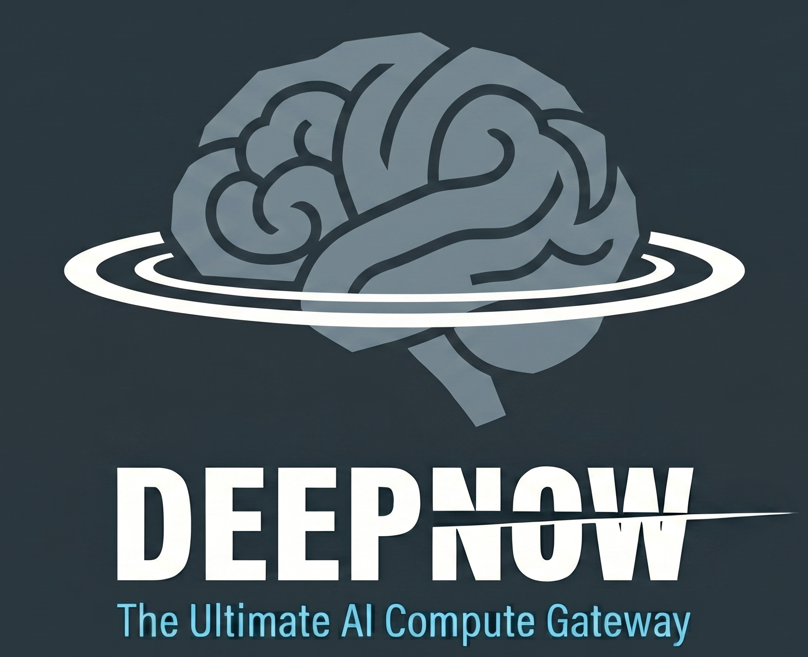
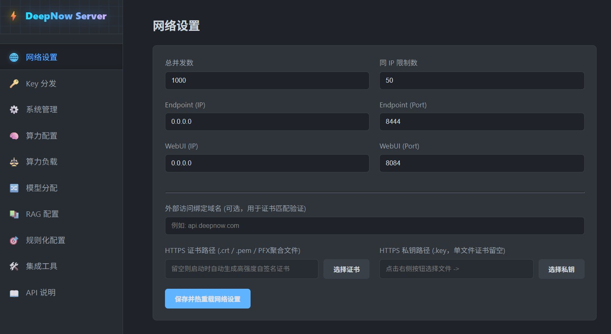
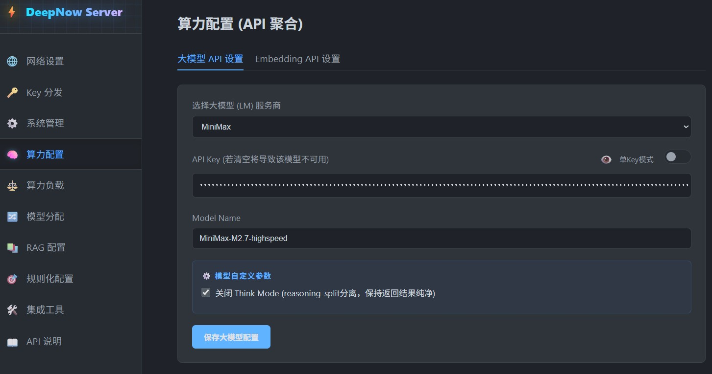
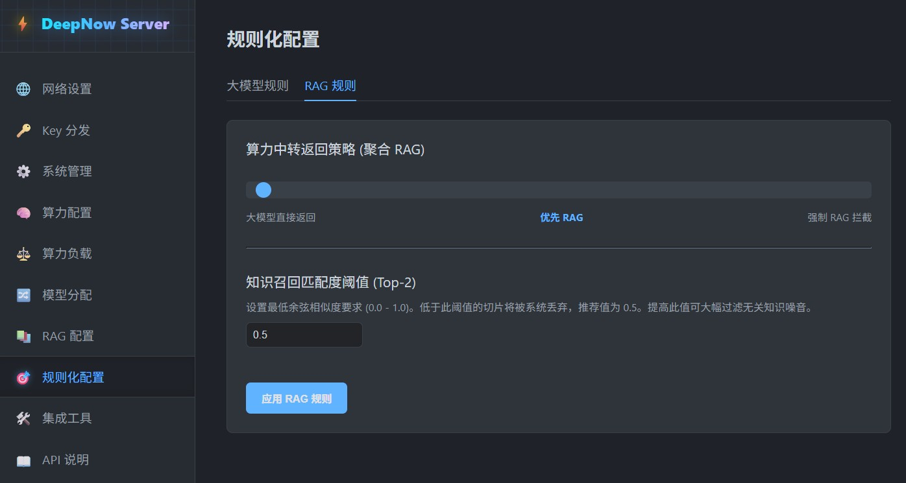
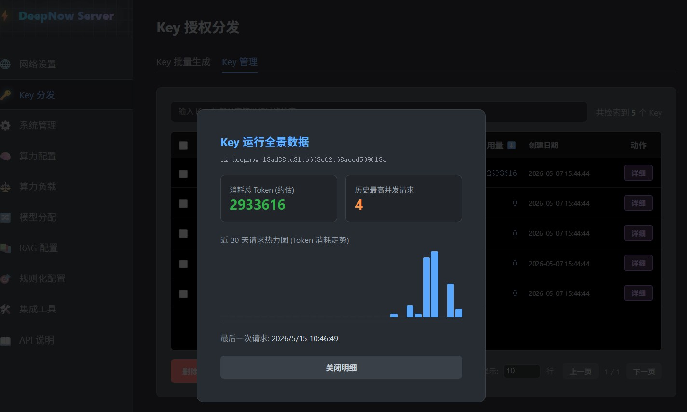
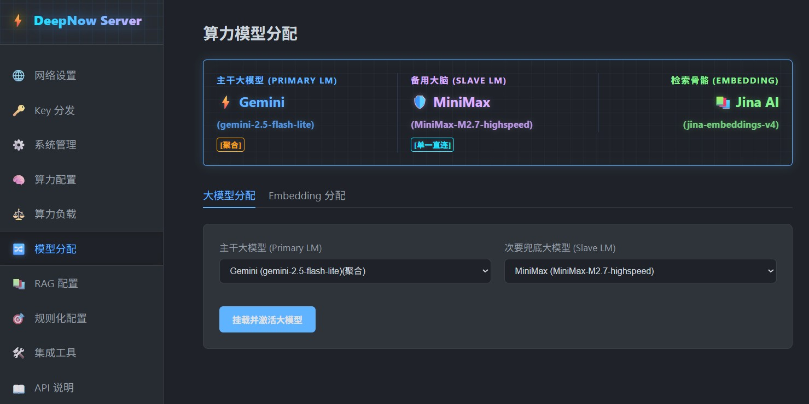
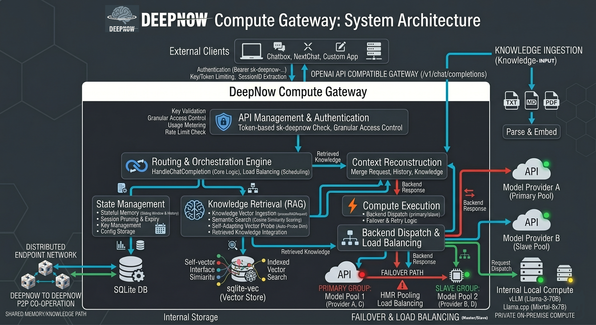

# ⚡ DeepNow(深脑) : The Ultimate AI Compute Gateway 

<div align="center">



**全场景聚合算力网关 & 智能 RAG 融合基座**

[](https://golang.org/)
[](LICENSE)
[](#)
[](#)
[](https://ziglang.org/)

*打造极致稳定、无缝接入的私有化 AI 算力中枢。*

</div>
玩法非常多样，你甚至可以主模型是纯文本模型，次模型是多模态，挂载后主模型无法识别文本会自动交给次模型处理
---
## 2026-05-29 重大Update ##
Codex 支持兼容性从只能做简单completion -> responses 对话转译且只能全文返回，到后来可以streamming responses sse，在到现在终于实现了几乎95%的全兼容，可谓进步飞速；也就是说在 Codex 新版移除了chat API方式的情况下，要使用codex完整功能（智能体能力）必须使用官方gpt模型。而Deepnow 已实现全封装转译且是sse支持，而且是通过转发最低级的兼容协议v1 completion 转译。意味着你哪怕不购买chatgpt或者使用任意低端模型，亦或者自己使用ollama 架设的qwen 3.6这样的本地模型，也可以无缝接入Codex ，让codex 可以实现自动工具调用和查询的编程。目前deepnow可能是唯一的可以实现无缝转译的工具，而且上端模型的端点(endpoint)只需要支持v1 completion即可。

## Big Update - May 29, 2026 ##
Codex compatibility has seen rapid progress. It evolved from simple completions to full conversational responses, then to SSE streaming, and now it finally supports nearly 95% full compatibility.

Essentially, since the latest Codex version removed chat API support, unlocking its full agent functionality usually required using the official GPT models. However, Deepnow has implemented a full translation wrapper with native SSE support, bridging the gap entirely through the base v1/completions protocol.

This means you don't need a ChatGPT subscription,you just  use any low-end model, or even a local Qwen 3.6 model hosted via Ollama( or Llama cpp), and seamlessly connect it to Codex for automated tool calling and programming queries. Deepnow is currently likely the only tool capable of this seamless translation, and the upstream model endpoint only needs to support standard v1/completions.
---

## 🌌 什么是 DeepNow？

在 __Token__ 为王的本世代，**Deepnow** 是一个专为(个人/企业)打造的高可用高并发场景打造的 AI 模型网关与知识融合底座（也可以形象的称之为Token 路由器）。它不仅能将各种孤立的大语言模型（LLM/VLM）和向量模型（Embedding）统一管理，还能为那些原本无状态、无长期记忆的 API 调用，注入原生 RAG 知识外脑与自带高速索引的滑动窗口记忆，同时还原生支持 __OpenAI__ 等各家专为智能体打造的 **Responses** 协议。

对于外部客户端（如 Chatbox、NextChat、OpenClaw、Codex 等）而言，DeepNow 是完全透明的。你只需将 Endpoint 替换为 DeepNow 的地址，即可瞬间让所有客户端拥有主备容灾、算力轮询以及深度的企业知识库支持，**100% 兼容 OpenAI API 调用标准**。

---

## ⚡ DeepNow 解决了哪些痛点？

### 1. 🚀 极致算力融合（突破并发限制）
>> 你可能正在苦恼：买了一堆 Token 算力，却没有一款能支撑起你的应用实现极速、高并发的响应。普通的非企业级模型资源通常有严格的速率限制（如 `RPM` 限制每分钟请求数、`TPM` 限制每分钟 Token 数、`RPD` 限制每日请求数等），无论应用端如何优化，都无法避开官方的接口限流。**DeepNow 彻底打破了这一枷锁：** 通过独创的算力融合技术，你只需组合多个廉价的个人 Token 算力（或极具性价比的开发者套餐），就能使其综合吞吐量达到甚至超越企业级算力标准。此外，你还可以将不同物理设备上部署的本地开源模型聚合起来集中调度，实现一个接口同时服务多个应用，无需购买昂贵的专业级算力设备，**彻底实现 Token 自由**。

### 2. 🛡️ 高可用与安全共享（告别单点故障与封号风险）
>> 无论你是个人极客（如 OpenClaw 玩家），还是企业级多人推理应用，最头疼的就是遇到“网络异常”或“当前算力高峰，请稍后再试”等模型商报错。这不仅会导致后续任务链断裂，还会带来极高的延迟。同时，当你希望将闲置算力共享给朋友或团队时，多人异地 IP 调用同一个 API Key 极易触发风控，导致封号或隐私泄露，责任难以界定。**DeepNow 让共享变得安全且可控：** 它可以作为隔离层接管所有请求。当某个节点或网络出现抖动时，系统会瞬间无感切换至备用算力；你还可以为团队成员生成专属的下发令牌，精准统计每个人的 Token 用量，让算力平摊和多用户共享成为可能，同时还不用暴露真正的大模型Token Key，还解决了团队或企业不用给所有成员购买单独的Token Key问题。

### 3. 📦 极简部署与强壮性能（零依赖，开箱即用）
>> 众所周知，任何虚拟化技术（即便是 Docker 等轻量级容器）都会带来额外的资源开销。开源社区的服务型软件往往伴随着繁杂的环境依赖，为了部署一个应用而翻阅无数文档、折腾配置文件的痛苦经历相信大家都有。**DeepNow 追求极致的简化和纯粹：** 抛弃臃肿的依赖包，易被投毒的npm/pip配置，更不用维护整条工具链，整个系统**仅需一个单体可执行文件即可运行**。无需手动编写复杂的配置文件，所有设置均可通过极其直观的可视化 H5 管理面板完成。先让服务跑起来，再进行精细化调优，这是 DeepNow 极客精神的核心体现。

### 4. 🧠 无感的知识库挂载（插拔式企业外脑）
>> 无论是个人还是企业，都有将其私有知识转化为 AI 记忆的需求。**DeepNow 可以无缝调度任意大模型来处理这些知识**。前端应用无需再开发复杂的 RAG（检索增强生成）召回逻辑，DeepNow 会在执行推理服务的同时，直接在底层召回相关知识并无缝织入上下文中。系统支持自定义检索兜底策略（例如：在未命中任何知识的**情况下**，直接拦截或降级使用大模型自身知识作答）。更巧妙的是，算力轮询架构同样作用于知识检索过程，这使得单一模型提供商无法获取你完整的上下文，从物理层面间接降低了数据链整体泄密的风险。DeepNow 还能以0幻想为前提(temp 0)在专业垂直场景内，将不同能力模型的推理输出拉齐一致性，让你的私有专业知识召回时不管用任何模型都完全一致。


### 5. 🔌 绝对的模型无关性（纯粹的计算）
>> **DeepNow** 的核心理念是让“前端业务逻辑”与“后端底层模型”彻底解耦。在这里，大模型退化为纯粹的计算单元（类似于电脑中的 CPU）。通过 DeepNow 统一的网关调度，你可以随时热拔插、切换远端底层模型或本地模型。而且还可以根据管理员的配置，在响应请求时自动对推理请求进行调度，不重要的推理请求可自动调度廉价模型，精确度要求高的可热调度高性能模型。


### 6. 🌐 树状分布算力网（无限裂变与级联）
>> **DeepNow** 节点之间可以相互嵌套与聚合！除了纯粹的算力共享外，其状态记忆与私有知识系统也能被其他 DeepNow 实例无缝调用，因为上下文和知识召回已经高度融合在返回的流式响应中。你可以构建多个专精于不同领域的 DeepNow 节点（例如：A节点懂代码且为聚合节点，B节点懂财务为混合模型节点，C节点为公司专有知识节点，强制RAG拦截后只会回答已喂入的知识，会推理喂入知识语义却不会胡乱回答）；最后，还可以用一个“总线级”X节点 DeepNow 将它们聚合，从而打造出一个具备全领域综合能力的超级 AI 中枢。前端应用可以根据需求连接A或B也可以直接连接更上层的X节点。

------------------------
后台 Dashboard GUI 截图:
------------------------
<details>
  <summary><h4 style="display:inline-block; cursor:pointer;">📊 网络设置<i><small>- Click 2 Detail</small></i></h4></summary>
  <div align="center">
    
    <p><i>网络设置</i></p>
  </div>
</details>

<details>
  <summary><h4 style="display:inline-block; cursor:pointer;">🧠 算力配置<i><small>- Click 2 Detail</small></i></h4></summary>
  <div align="center">
    
    <p><i>算力配置</i></p>
  </div>
</details>

<details>
  <summary><h4 style="display:inline-block; cursor:pointer;">⏳ RAG捆绑策略<i><small>- Click 2 Detail</small></i></h4></summary>
  <div align="center">
    
    <p><i>记忆策略配置 - 物理 Key 级会话滑动窗口拦截与历史注入设置</i></p>
  </div>
</details>
  
<details>
  <summary><h4 style="display:inline-block; cursor:pointer;">🔐 Key全景<i><small>- Click 2 Detail</small></i></h4></summary>
  <div align="center">
    
    <p><i>Key全景</i></p>
  </div>
</details>

<details>
  <summary><h4 style="display:inline-block; cursor:pointer;">⏳ 模型分配<i><small>- Click 2 Detail</small></i></h4></summary>
  <div align="center">
    
    <p><i>Key全景</i></p>
  </div>
</details>

---

<details>
  <summary><h2 style="display:inline-block; cursor:pointer;">🔥 核心特性 (Core Features) <i><small>- 点击展开详情</small></i></h2></summary>

### 🛡️ 1. 全域算力汇聚 (Compute Combined)
* **主备冗余 (Primary/Slave Failover):** 为生产环境量身打造的高可用防线。不仅支持常规单体大模型的无缝毫秒级切换，保障 API 调用 99.99% 的可用性，更支持将一整套“聚合模型”挂载为灾备节点。
* **同构聚合 (Token Aggregation):** 组合 ≥2 个相同的模型实例。在绝对保证原始推理智商与效果 100% 一致的前提下，完美分摊请求负载，彻底突破官方 API 的 TPM (Tokens Per Minute) 与并发 (Concurrency) 硬限制。
* **混合轮询 (Hybrid Round-Robin):** 支持将多个异构大模型组合为“混合调度池”。它能将你手中零散、免费的模型额度全部“榨干”，自动进行负载均衡，大幅缓解业务高峰期的单一 API 压力。
* **超混编排 (Super Hybrid):** 终极算力形态！支持将“异构单体模型”与“同构聚合模型池”进行二次组合，形成深度的“超混调度网”，满足极其复杂的企业级并发分流策略。

### 🧠 2. 动态探针 RAG 向量引擎 (Dynamic RAG Engine)
* **极致轻量底座:** 彻底摒弃臃肿的独立向量数据库（如 Milvus 等）。底层采用 CGO 直接绑定的 `sqlite-vec`，实现零依赖、高性能的单机亿级向量检索。
* **维度自适应探针 (Auto-Probe):** 无论你接入的是 768 维的经典模型，还是 3072 维的最前沿模型（如 `gemini-embedding-001`），系统在首次摄入知识时，会自动发射探针测定 Embedding 模型的向量维度，并动态重构底层张量表结构，真正做到“即插即用”。
* **时空溯源追踪:** 每一条被 RAG 引擎召回的上下文，不仅提供精准的知识切片，还精确携带录入时间戳与来源文件属性。这不仅彻底消灭了 AI 的幻觉，更提供了极简的知识库维护体验，让大模型在特定业务下直接拥有类似 LoRA 级微调的专有知识表现。

### ⏳ 3. 滑动窗口记忆增强 (Stateful Memory Injection)
突破标准 `/v1/chat/completions` 接口的无状态限制。DeepNow 在网关层内置了高性能关系型记忆存储引擎。外部客户端无需自行维护庞大的历史上下文，DeepNow 能基于 `API Key + Session ID` 自动实施滑动窗口拦截，将历史对话无缝拼接到当前请求中，并推送给承接算力的底层大模型。同时还支持最新的SSE或流式响应协议 `v1/Responses` 这使得Deepnow 不仅可用于计算推理，还可以应用于Agent 前端。 

### 🔐 4. 细粒度资源管控 (Access Control & Stats)
支持无限量生成以 `sk-deepnow-` 开头的专属消费令牌。并可对每一个令牌实施物理级管控：
* 总 Token 消耗绝对额度限制。
* 最高并发请求数 (Concurrency) 硬拦截。
* 提供细化到每日的流量走势图表与高精度 Token 使用明细，便于管理员进行跨团队成本分摊与模型提供商对账。

### 🤖 5. 自驱型 Agent 演进 (Self-Learning Agent - *TODO*)
未来，DeepNow 将在后台引入自驱型 Agent 机制。它能够在空闲算力期间，主动调用外部 Search API 获取全网实时信息，并结合大模型推理进行“自我总结与消化”。配合用户日常被动喂入的 RAG 知识碎块，系统将实现专有领域知识库的“主动生长与进化”，甚至可以主动完成事务性连续工作任务的响应，还可以通过custom协议来实现沙箱、搜索工具等的主要能力的整体集成化，无需recall本地工具实现，极大的减少交互次数和提高智能体效能。

</details>

<div align="center">

<p><i>Basic Architecture</i></p>
</div>

---

## 🚀 极速接入 (Quick Start)

DeepNow 采用全静态编译与资源内嵌技术，开箱即用，无需复杂的部署流程，除需配置大模型和Embedding模型的接口地址外，无需再配置或安装任何第三方组件；release 版无需docker或npm等相关环境安装、无任何三方依赖且跨平台，干净免维护一个二进制文件走天下（系统自带GUI dashboard/向量数据库/关系存储系统等）

```bash
# 1. 运行 DeepNow 服务端
Linux 下:
./deepnow

Windows 下:
直接执行deepnow.exe 

看到控制台输出文字并监听成功后可打开浏览器直达控制面板，deepnow 默认绑定设备的所有IP。

# GUI Dashboard 默认绑定 8084 端口，使用 http 访问

浏览器打开 http://127.0.0.1:8084/ 即可，端口可以在后台自己重新配置。

# 注意，默认情况下系统使用https提供endpoint 端点服务，第一次运行系统会下发一个为期10年的自签名证书。
# 但是遇到需要强制验证签名的客户端可能无法通过，所以最好配置真实证书并使用域名访问。
