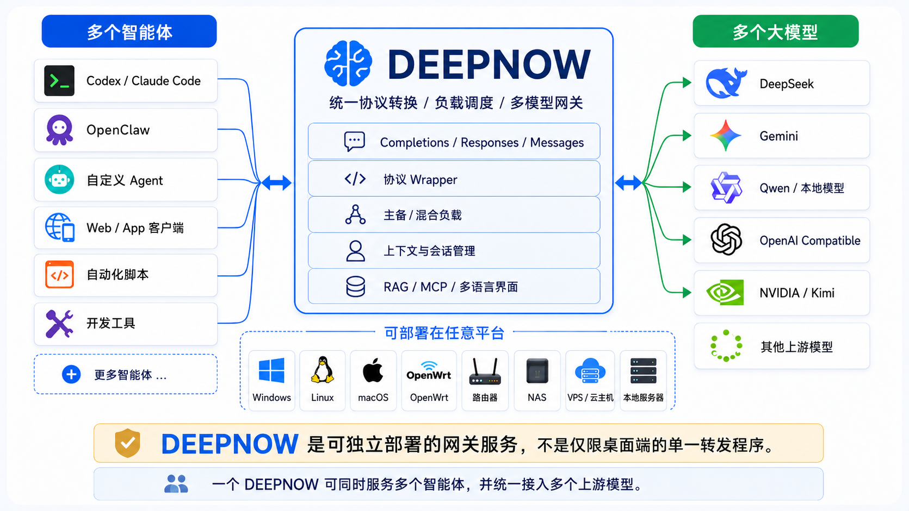

# ⚡ DeepNow(深脑) : The Ultimate AI Compute Gateway ( Router )

<div align="center">


**全场景聚合 AI 路由(网关) & 智能 RAG 融合基座**

[](https://golang.org/)
[](LICENSE)
[](#)
[](#)
[](https://ziglang.org/)

* 核心理念:实现批量任务接续对模型无关性、多模态可漂移、上下文可迁移、Provider 可切换、工具任务可分发、多 Key 可负载、多模型可管理，天生适合服务于各类并发任务智能体并协商所有模型最大化兼容性。

</div>

<div align="right">
  <a href="README-eng.md">English</a> | <a href="README.md">简体中文</a>
</div>

## ⚡ 什么是 DeepNow

&nbsp;&nbsp;&nbsp;&nbsp;&nbsp;&nbsp;&nbsp;&nbsp; 在 __Token__ 为王的当下，**Deepnow** 是一个专为(个人/企业)打造，面向高可用、高并发，全场景使用的 AI 模型网关(路由)与知识融合底座，它不仅能将各种孤立的大语言模型（LLM/VLM）和向量模型（Embedding）统一管理、调度，还可以通过绑定算法使他们聚合使用，实现算力整合与容灾。通过把多家模型运营商的资源整合利用，最大化为你的前端应用或开发场景提供最强劲的Token动力。通过聚合，你可以轻松突破各家模型运营商的各类TPM、并发等限制，不管是面向多人团队 vibe coding 或是长文本融合应用，亦或者是高密集度突发调用，Deepnow 都可以实际解决你的问题，基本上 Deepnow 就像是在AI时代你的私人软路由器(Soft Router)，只不过这个 Router 管理的流量不再是 TCP/IP 网路包，而是 Token 流量，所以你可以把 Deepnow 看成是一种全新的 TR 或 TG (Token Router / Token Gateway)。

&nbsp;&nbsp;&nbsp;&nbsp;&nbsp;&nbsp;&nbsp;&nbsp; 使用 Deepnow 后，你可以把前端所有的app应用或者开发工具的 Token 端点(Endpoint)指向 Deepnow ，以实现对所有应用、特定应用的流量走向、负载均衡等统一控制，还可以随时在线热切换模型，你不必为每一个应用都去单独配置某家Token运营商的API key，所有应用都统一配置为 Deepnow 生成的 key 和 Endpoint 地址即可。通常，当你的AI应用希望切换模型时你需要使用文本编辑器去编辑每一个应用的 Endpoint URL 和 API Key，非常繁琐；如果是面向用户的应用，那这种切换会变得成本极其高昂，特别是智能体相关应用，切换模型往往可能造成智能体本身失效或失去自动配置的能力。而通过 Deepnow 你的全部应用实际上就具备了热切换模型的能力，甚至还可以实现基于Key的模型路由，实现如 OpenRouter 网关应用一样的自定义多模型功能，但 Openrouter 本身也是一个远端多模型网关，所有的端点都在远程，你完全无法掌控，一个在本地运行的多模型AI网关才是令人安心的，更不会有网络抖动或安全带来的问题。

&nbsp;&nbsp;&nbsp;&nbsp;&nbsp;&nbsp;&nbsp;&nbsp; 但，Deepnow 的能力远不止于这些。

&nbsp;&nbsp;&nbsp;&nbsp;&nbsp;&nbsp;&nbsp;&nbsp; 如果你是一个团队(企业)管理员，你肯定不希望给每一个员工都单独购买一个私人 Key，因为模型提供商的 Key 如果被员工随意分享可能会给企业带来巨大损失；同样，你肯定还希望能够实时了解每一个员工或者某个应用的流量使用情况，或者在某些特定场景希望多人分摊算力和成本但有苦于没有工具实现。如今， Deepnow 都可以帮到你，因为 Deepnow 可以生成和分发自己的 Key 给使用者，并且可以基于 Key 来绑定特定的并发能力、模型选择和设定流量阈值等，还可以随时收回。

&nbsp;&nbsp;&nbsp;&nbsp;&nbsp;&nbsp;&nbsp;&nbsp; 如果你希望搭建一个业务机器人，你也不需要额外的工具。不管是面向企业内部知识，还是让AI承袭某些业务经验，你都能够以近乎傻瓜式的操作方式直接喂给 Deepnow ，你完全不用有任何模型训练能力，你就拥有了一个拿世界顶级模型大脑来读懂和学会你私有知识和经验的解决方案，瞬间就成为一个懂你的私有化AI和数字员工，在多个应用调用你的私有化AI时都能承袭你的私人知识和对这种知识的逻辑化推理和响应的能力。在培训、医疗、科研、产品功能展示，后端维护等等诸多严禁知识幻觉的场景，Deepnow 都可以随时为你打造。

&nbsp;&nbsp;&nbsp;&nbsp;&nbsp;&nbsp;&nbsp;&nbsp; 当下，市面上眼花缭乱的智能体和天女散花般的模型，导致前端、后端可能都有各自的协议，而随着时代的发展，以往全面被兼容的 OpenAI v1/completions 协议正在被行业抛弃，随之取代的是更加高级的 Responses 和 Messages 协议，但这些协议之间往往都有各家自己的特色和“私货”，在兼容性方面难以互相兼顾，但 Deepnow 却可以轻松帮你解决这些问题。你可以不用购买额外的远端服务，在本地就可以轻松实现 Openclaw / Codex / Hermes 主流智能体挂载任何大模型的能力，且你可以为这些智能体开启更加高级的并发模式，成倍缩短智能体解决综合事物的时间，这点是目前任何AI网关都不具备的能力。

&nbsp;&nbsp;&nbsp;&nbsp;&nbsp;&nbsp;&nbsp;&nbsp; 未来，Deepnow 还将具备整合mcp服务、Plugin、ServerSide task、模型无关的自有上下文维护、Severside skills、多模态聚合（即：你可以用不同能力的模型拼接在一起，实现图片声音识别、图形生成的总响应能力，因为我们都知道世上没有一个模型在所有领域都可以同时顶尖，我们需要按需分配AI算力路由）等等这些能力。

&nbsp;&nbsp;&nbsp;&nbsp;&nbsp;&nbsp;&nbsp;&nbsp; 总之，Deepnow 将会是一种AI基础设施，一种强大的算力底座，一种可挂载各种先进能力的 AI 流量路由器。

## ⚡ 基础构架

  <div align="center">
    
    <p><i>Basic Architecture</i></p>
  </div>

## ⚡ DeepNow 解决了哪些痛点？

<details>
  <summary><b>🎯 任意模型投递</b></summary>
  <br>
&nbsp;&nbsp;&nbsp;&nbsp;&nbsp;&nbsp;&nbsp;&nbsp;可能是目前唯一实现跨模型上下文投递的AI Routing方案。<br><br>
&nbsp;&nbsp;&nbsp;&nbsp;&nbsp;&nbsp;&nbsp;&nbsp;也就是说你的工作执行了一半后，只要你的智能体或者对话客户端维护了上下文，你可以实现在同一个会话里前面的工作是一个模型完成的，当遇到突发状况需要切换模型继续工作时你完全不必要新开对话，deepnow 会把你的上下文重新加载并按照目标模型可以接受的格式重新投递，使你能继续你未完成的工作。比如：Deepseek写了一段代码后token不够了，而你正好手头还有Gemini，你可以立刻通过挂载Gemini来继续你手头的工作。普通情况下2者模型在payload上有很多不同，没有deepnow你即便在智能体会客户端上简单更改端点(Endpoint)是无法继续的。
</details>
<details>
  <summary><b>🚀 协议封装转换</b></summary>
  <br>
&nbsp;&nbsp;&nbsp;&nbsp;&nbsp;&nbsp;&nbsp;&nbsp;业界模型日新月异且支持的协议各有不同，有的是本身是单模型多模态、有的是多模型单端点支持多模态、还有的只支持老的Completions协议，或者有的只支持SSE。如果一个前端应用想尝试业内所有任意一款模型，可能就会发生由于 payload 结构不支持导致返回400错误；还有的的应用可能只支持最新的Responses协议，但我们手头的模型又只支持 Completions 怎么办？ 以往的 AI 网关路由均是采用透传的方法支持多模型，但无法做到末端一致性。也就是说当你使用的前端应用只支持 Completions 时要么你换应用，要么换模型，反之亦是如此。<br><br>
&nbsp;&nbsp;&nbsp;&nbsp;&nbsp;&nbsp;&nbsp;&nbsp;而 Deepnow 的协议Wrapper可以抹平前后端差异。我们支持2种方式进行模型路由：1) 协议劫持转换 2) 透传 。难能可贵的是，不管是采用透传方式还是协议Wrapper方式转发请求给上游模型，我们都依然支持混合负载逻辑、依然支持RAG融合，前端应用永远不用关心上游模型的兼容性，只需要兼容Completions/Responses/Messages 任意一种即可。
</details>
<details>
  <summary><b>🧠 实现优答 (Token-Aware Optimal Routing)</b></summary>
  <br>
&nbsp;&nbsp;&nbsp;&nbsp;&nbsp;&nbsp;&nbsp;&nbsp;Deepnow 除了有同模型聚合、多模型混合、灾备等调度算法外，还有一套自主独有的“优答”算法，该算法的核心是对2种业务场景实现最优解。<br><br>
  1）推理速度优先：用户可以绑定>=2个极速且廉价模型，deepnow 会把一个推理请求同时分发给N个极速且轻量化模型(可以是本地)，任何一个有应答即刻把应答内容返回请求者，丢弃其它应答；<br><br>
  2）推理层级排序 Re-rank：用户可以把多个模型按照其推理能力排列应答次序。首先挂载分析模型，由一个轻量级大模型先对问题的意图（Intent）和关键词特征信息，并并将其归类（Classification）后推给分类不同层级的大模型来按需实现推理难度的解答，从而做到精细化的Token付费和更准确的推理结果。
</details>
<details>
  <summary><b>🚀 高可用、极致算力融合，突破并发限制</b></summary>
  <br>
&nbsp;&nbsp;&nbsp;&nbsp;&nbsp;&nbsp;&nbsp;&nbsp;你可能正在苦恼：买了一堆 Token 算力，却没有一款能支撑起你的应用实现极速、高并发的响应。普通的非企业级模型资源通常有严格的速率限制（如 `RPM` 限制每分钟请求数、`TPM` 限制每分钟 Token 数、`RPD` 限制每日请求数等），无论应用端如何优化，都无法避开官方的接口限流。<b>DeepNow 彻底打破了这一枷锁</b>： 通过独创的算力融合技术，你只需组合多个廉价的个人 Token 算力（或极具性价比的开发者套餐），就能使其综合吞吐量达到甚至超越企业级算力标准。此外，你还可以将不同物理设备上部署的本地开源模型聚合起来集中调度，实现一个接口同时服务多个应用，无需购买昂贵的专业级算力设备，**彻底实现 Token 自由**。同时，在需求高可用的业务场景，前端应用都不想收到任何 ""...high demand, please try again later..." 此类的尴尬提示。此类非正常应答都会被 deepnow 捕获，当意外应答出现，将会全自动的使用备用模型重发请求，前端是无感的。
</details>
<details>
  <summary><b>🛡️ 算力共享</b></summary>
  <br>
&nbsp;&nbsp;&nbsp;&nbsp;&nbsp;&nbsp;&nbsp;&nbsp;无论面向个人AI geeker（如重度 Hermes/ OpenClaw 玩家），还是企业级多人AI应用，Deepnow 都可以实现同一算力资源分享给不同应用和不同使用者。因为 Deepnow 自己可以生成和管理一套自己的鉴权系统 (API Key) 你可以让一个Key共用给你的多个应用，还可以让多个Key分享给多个人。以往，多人异地 IP 使用同模型Key调用同一模型商极易触发风控，导致封号或隐私泄露，责任难以界定。而使用Deepnow 后真实调用者将被隐藏，对模型商来说所有调用均来自 Deepnow，这就让共享变得安全可控。 Deepnow 还可以基于自身分发的Key统计Token进出流量，并写入内、外部数据库（sqlite/mysql) 你可以自己开发基于数据库的Token管理UI实现流量二次计费、管理等。
</details>
<details>
  <summary><b>📦 敏捷部署与强大性能（零依赖，开箱即用）</b></summary>
  <br>
&nbsp;&nbsp;&nbsp;&nbsp;&nbsp;&nbsp;&nbsp;&nbsp;当前各种开源AI应用大部分使用Python开发，除了要安装各种错综复杂的依赖库以外(甚至依赖库版本错误也可能无法启动)，还有承受python天生的性能不佳问题。而 Deepnow 一开始的目标就是不对性能妥协的对标企业级承载应用，使用编译型Go和C语言混合开发，同时内置所有组件而无需额外安装，就连UI界面也是打包进本体而无需额外挂载，真正做到“下载和执行”2步开箱即尝。没有细碎的组件和依赖库，更没有沉重的 Docker ，你只要选好针对目标平台的分发二进制文件，一个文件你就可以在N个设备上1秒部署并运行。无需手动编写复杂的配置文件，所有设置均可通过极其直观的可视化 H5 管理面板完成。先让服务跑起来，再进行精细化调优，这是 DeepNow 针对敏捷部署设计的极致体验。
</details>
<details>
  <summary><b>🧠 无感的知识库挂载（插拔式大脑）</b></summary>
  <br>
&nbsp;&nbsp;&nbsp;&nbsp;&nbsp;&nbsp;&nbsp;&nbsp;无论是个人还是企业，都有将其私有知识转化为 AI 记忆的需求。<b>DeepNow 可以无缝调度任意大模型来处理这些知识</b>。前端应用无需再开发复杂的 RAG（检索增强生成）召回逻辑，DeepNow 会在执行推理服务的同时，直接在底层召回相关知识并无缝织入上下文中。系统支持自定义检索兜底策略，如：在未命中任何知识的 **情况下**，直接拦截或降级使用大模型自身知识作答。更巧妙的是，算力轮询架构同样作用于知识检索过程，这使得单一模型提供商无法获取你完整的上下文，从物理层面间接降低了数据链整体泄密的风险。DeepNow还能针对0幻想为前提(temp 0)在专业垂直场景，使用Inject Prompt技术将不同能力模型的推理输出结果拉齐一致性返回，让你的私有专业知识召回时不管用任何模型都按请求的精确格式。Deepnow 知识系统将会支持图文、音频的多模态召回，且每一种即可使用单独专业模型交叉混合输出不同模态的内容，也可以独立使用多模态模型直接实现，但在最终推理结果上却有实现融合。无论对文本知识，还是结构化的知识图谱都能完成学习并可以合并用于推理任务，从而让智能体 Agent 等前端应用实现完全定制化的精确任务流。<br><br>
&nbsp;&nbsp;&nbsp;&nbsp;&nbsp;&nbsp;&nbsp;&nbsp;**DeepNow** 的核心理念是让“私有逻辑”与“推理模型”彻底解耦。在这里，大模型退化为纯粹的计算单元、属于本能认知层，底层知识才是你专属AI的大脑。 通过 DeepNow 统一的网关调度，你不仅可以随时热拔插、切换远端底层模型或本地模型，更可以切换不同种类的底层知识挂载，甚至对知识片段单独实现移除和重恢复以适应各种场景。其核心技术是对知识语义(包含图像)的筛略、通过向量空间比对、重索引和排级(Reindex/ReRank)、语义扩张命中等多个维度实现知识的定位和实时知识流的推理。达到类似预训练私有模型的效果，却无需付出训练私有模型的成本。<br><br>
&nbsp;&nbsp;&nbsp;&nbsp;&nbsp;&nbsp;&nbsp;&nbsp;此外，Deepnow 还将具备自我知识学习和存储的能力，可以根据权限设置把所有请求内容转换成记忆，且无长度限制。
</details>
<details>
  <summary><b>🌐 树状分布算力网（无限裂变与级联）</b></summary>
  <br>
&nbsp;&nbsp;&nbsp;&nbsp;&nbsp;&nbsp;&nbsp;&nbsp;**DeepNow** 节点之间可以相互级联！除了纯粹的算力共享外，其状态记忆与私有知识系统也能被其他 DeepNow 实例无缝调用，因为上下文和知识召回已经高度融合在返回的流式响应中。你可以构建多个专精于不同领域的 DeepNow 节点（例如：A节点挂载的是企业员工的知识图谱大脑，B节点挂载的是企业产品大脑，C节点为公司经营分析大脑）以一个上层节点将它们聚合，从而打造出一个具备全领域综合能力的超级私有化 AI 中枢。同时，前端应用可以分权限、需求连接A或B节点或者为最顶层超级节点。
</details>

##  ⚡ 同类项目的对比


| 维度 / 功能 | **DeepNow (边缘本地算力网关)** | **Cherry Studio (CC Switch)** | **OpenRouter (云端路由 SaaS)** | **OneAPI / NewAPI (中转管理系统)** |
| :--- | :--- | :--- | :--- | :--- |
| **本地网关能力** | ✅**可当核心或边缘网关**<br>· 敏捷部署绿色运行<br>· 内嵌高并发中间件，以服务运行本地托管 | ❌**纯桌面应用**<br>· UI 视图级中转<br>· 仅服务于当前登录的单用户,桌面软件 | ❌**云端商业 SaaS**<br>· 集中式托管<br>· 必须连接外网云端 | ❌**云端中间件**(多人)<br>· 依赖 Docker 容器化<br>· 强依赖外部多个三方组件，部署复杂 |
| **高并发调度与缓存** | ✅**微秒级内存高速状态机**<br>· 基于内存快照与字典树实现 $O(1)$ 级吞吐<br>· 并发锁机制防止突发洪峰 I/O 击穿 | ❌**无高并发处理能力**<br>· 仅限于本地单客户端内的 API 转发与静态切换 | ✅**云端多级弹性调度**<br>· 具备云端高并发承载力<br>· 商业级按量计费与资源控制 | ❌**标准数据库级轮询**<br>· 每次请求频繁请求物理 DB 扣费与校验渠道<br>· 高并发下 DB 易成为性能瓶颈 |
| **密钥安全性** | ✅**指纹AES加密，保存本地**<br>· 绑定物理设备派生 MasterID<br>· 磁盘配置文件混淆，防盗、防脱裤、防跨设备解析，管理员可导出 | ❌**明文**<br>· Key 保存在本地客户端本地存储中，无设备物理隔离防护 | ❌**远程托管**<br>· 用户的API Key完全托付并保存在 OpenRouter 云端服务器 | ❌**数据库常规加密**<br>· 依赖 MySQL/PgSQL 自身安全防御与常规明文/哈希存储 |
| **向量引擎** | ✅**一体化内嵌语义底座**<br>· 纯 C 语言级 `sqlite-vec` 向量引擎内置<br>· 无缝支持高并发切片与实时向量化写入 | ❌**客户端外接/无内嵌**<br>· 依赖客户端应用层本地调用或对接第三方云端向量服务 | ❌**无向量/无语义处理**<br>· 纯粹的大模型原始协议和 Token 流式分发层 | ❌**无内嵌向量库**<br>· 纯管理分发通道<br>· 部分衍生分支通过插件或外接二次开发支持 |
| **知识库检索** | ✅**RRF 双轨归一化决选 + 短路拦截**<br>· **向量+标签+语义重排**混合检索归一化评分<br>· 支持放行保护（防向量表征偏移）<br>· **滑块2档强制短路拦截**：未命中直接切断外联并回弹未知标志，零成本杜绝大模型胡言乱语 | ❌**无检索能力**<br>· RAG 检索完全由前端客户端 UI 应用自行组装 Prompt | ❌**无短路拦截机制**<br>· 无法感知用户业务数据，所有无效或盲区提问均会透传给远端模型，产生无效 Token 费率 | ❌**无网关层语义拦截**<br>· 属于纯管道透传角色<br>· 无法在网关层根据本地知识命中率切断或短路请求 |
| **协议兼容性** | ✅**兼容 responses/completions 完整协议**<br>· 支持有状态 Responses / Runs 拓扑重组<br>· 自动对齐有状态 Agent 历史链路与多模态隔离分发，可R对C或C对R转译，也可透传 | ❌**标准单回合协议**<br>· 协议转换能力不详 | ✅**标准通用协议中转**<br>· 核心专注于各大云端厂商标准 Chat 协议的抹平与分发,对Responese 支持不完整 | ❌**旧协议中转**<br>· 主要支持标准 `v1/chat/completions` 与格式转换，无 Agent 有状态托管层 <br>· 无状态中转 |
| **边缘微服务与扩展** | ✅**内置安全审计的 MCP 服务端**<br>· 支持就地消化工具（Tools）<br>· 直接向 Codex 客户端暴露并执行本地算力微服务 | ❌**仅作为 MCP 客户端**<br>· 只能引入第三方的 MCP 服务，自身无法作为安全微服务源向外提供算力 | ❌**远端服务，无本地资源集成能力**<br>· 无法连接、控制或调度用户本地局域网内的任何硬件或私有资源 | ❌**无边缘 MCP 协议层**<br>· 不具备就地拦截、消化并重组本地工具链的微服务生态 |
| **高可用与负载均衡** | ✅**主备双轨（Primary/Slave）+ 自愈 + 聚合 + 超混(聚合形态主备或全模型混合)** <br>· 网关层<br>· 内嵌 TLS 可挂载证书 | ❌**只有容灾**<br>· 极简故障切换，本质依然面向桌面应用 | ❌**云端自动 Failover，无负载均衡策略**<br>· 云端多渠道备用路由切换，但由于链路长，TTFT 易受云端网络波动影响 | ✅**多渠道权重负载均衡**<br>· 支持基于数据库渠道配置的权重轮询与自动禁启用，但无临终状态时序重组 |
| **自签发Key系统** | ✅**完善的key管理和签发** <br>· 可签发任意多的key <br>· 可设定key使用市场、流量大小、可用模型 | ❌**设计为本地单用户使用**<br>· 无签发系统 | ❌**商业服务**<br>· 本质是提供多模型服务，无法使你建立自己的多模型服务 | ✅**商业级的Key签发**<br>· Key支持多级子Key，可管理 |
| **效能和易用** | ✅**无需安装** <br>· 无需npm/无需node.js <br>· 作为后端应用自带WebUI，可部署在本地应用之外的局域网或广域网设备 <br>· 原生go func高并发 | ❌**有依赖**<br>· 本质是node.js前端+无头后端的混合桌面级应用，控制依靠IPC传递 <br>· 需与应用同设备 | ❌**无需任何安装**<br>· 应用可直接访问提供商远端API URL，但可能产生费用 | ❌**需安装多级依赖和组件**<br>· 臃肿庞大，多并发能力极差 <br>· 转发验证频繁读取db |
| **协议Wrapper** | ✅**内置协议转换** <br>· 可将 Completions 转 Responses 或相反方向转换 <br>· 全模型支持全前端 | ❌**透传**<br>· 基本是协议透传 | ❌**透传**<br>· 完全透传 | ❌**透传**<br>· 完全透传 |


## ⚡ 图片
<details>
  <summary>点击展开</summary>
  <div align="center">
    
    <p><i>网络配置</i></p>
  </div>
  <div align="center">
    
    <p><i>算力配置</i></p>
  </div>
  <div align="center">
    
    <p><i>记忆策略配置</i></p>
  </div>
  <div align="center">
    
    <p><i>Key全景</i></p>
  </div>
  <div align="center">
    
    <p><i>算力分配</i></p>
  </div>
</details>

## ⚡ 能力构建

  <div align="center">
    
    <p><i>能力构建</i></p>
  </div>

---

## ⚡ 开箱即用 (Quick Start)

DeepNow 采用全静态编译与资源内嵌技术，开箱即用，无需复杂的部署流程，除需配置大模型和Embedding模型的接口地址外，无需再配置或安装任何第三方组件；release 版无需docker或npm等相关环境安装、无任何三方依赖且跨平台，干净免维护一个二进制文件走天下（系统自带GUI dashboard/向量数据库/关系存储系统等）

```bash
# 1. 运行 DeepNow 服务端
Linux 下:
./deepnow (前台运行)
or
nohup ./deepnow >& /dev/null & (后台守护运行)

Windows 下:
直接执行 deepnow.exe (不推荐放在本机运行)

#看到控制台输出文字并监听成功后即表示运行 ， deepnow 的服务端口默认绑定设备的所有IP。

运行后成功后即可使用后台配置界面

# GUI Dashboard 默认绑定 8084 端口，使用 http 访问 (为安全考虑只绑定 127.0.0.1 )

浏览器打开目标设备 [http://targetip:8084] 进入后台管理页面，如果是本机则直接访问 http://127.0.0.1:8084/ ，端口可以在后台自己重新配置。

# 注意，默认情况下系统使用 HTTP 提供 AI endpoint 端点服务。
# 可以通过8084的后台 GUI 调整为 TLS(HTTPS) 服务模式，首次运行系统会下发一个为期10年的自签名证书,但对于安全要求较高的客户端(如:codex等)可能无法使用。
# 建议不提供多人服务只作为个人开发时，保持 HTTP 形态的端点以获得各类客户端的最大兼容性

第一次运行后，会在deepnow所在的目录下生成向量数据库和若干配置文件。

```

<div align="left">
  <a href="/doc/codex.md">Codex 配置指南</a> | <a href="/doc/hermes.md">Hermes 配置指南</a>
</div>

